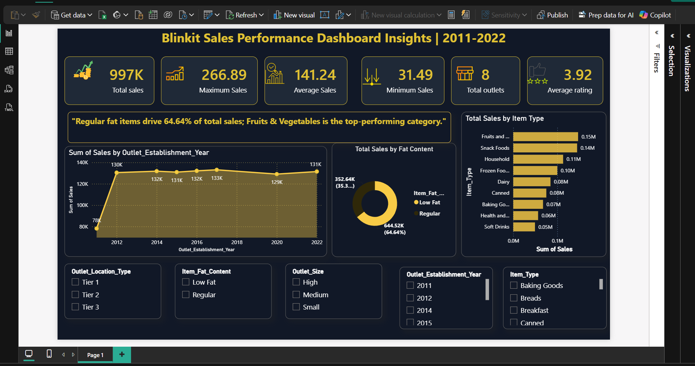

# 🛒 Blinkit Sales Dashboard | Power BI

## 📌 Project Overview

This project presents an interactive Power BI dashboard built to analyze Blinkit's sales performance. The dashboard provides valuable business insights into sales trends, outlet performance, product categories, and customer ratings to support data-driven decision-making.

> **Note:** The original Excel dataset was imported into Power BI and cleaned using **Power Query** before creating the dashboard.

---

# 📊 Dashboard Preview

---

# 🎯 Business Objectives

- Analyze overall sales performance.
- Identify top-performing outlet types.
- Compare product categories.
- Track customer ratings.
- Monitor outlet size and location performance.
- Build an interactive dashboard for business insights.

---

# 📈 Key Performance Indicators (KPIs)

- 💰 Total Sales
- 📦 Total Items Sold
- ⭐ Average Rating
- 💵 Average Sales
- 🏪 Number of Outlets

---

# 📊 Dashboard Features

- Interactive Slicers
- KPI Cards
- Sales Trend Analysis
- Outlet Performance Analysis
- Product Category Analysis
- Outlet Size Analysis
- Fat Content Analysis
- Outlet Location Analysis

---

# 🛠️ Tools & Technologies

- Power BI
- Power Query
- DAX
- Microsoft Excel

---

# 📂 Dataset

- BlinkIT Grocery Dataset (Excel)

---

# 💡 Key Insights

- Supermarket Type 1 generated the highest sales.
- Tier 3 outlets contributed significantly to overall revenue.
- Regular Fat products recorded higher sales than Low Fat products.
- Fruits and Snack Foods were among the best-performing product categories.

---

# 🚀 Skills Demonstrated

- Data Cleaning
- Data Transformation
- Data Modeling
- DAX Measures
- Data Visualization
- Dashboard Design
- Business Intelligence

---

# 👩‍💻 Author

**Annu Gautam**

Aspiring Data Analyst

📍 Greater Noida, India
